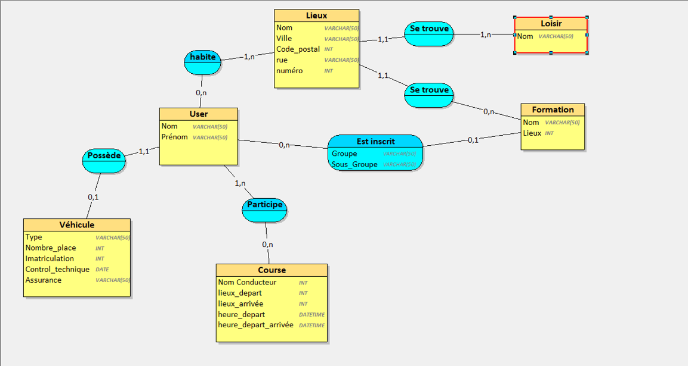

# SAE2.3

## Présentation

### Groupe 12 -> Sujet Strong

**Objectif :**
Développer une application web permettant aux étudiants de gérer et organiser leurs trajets en commun, afin de faciliter leurs déplacements vers leurs cours et leurs loisirs. Cette application proposera des options de mobilité partagée telles que le covoiturage, en fonction des trajets, des horaires et des disponibilités des étudiants.

---

**Problématique :**
Comment aider les étudiants à organiser efficacement leurs déplacements en commun en développant une application qui regroupe leurs trajets, moyens de transport et disponibilités, tout en offrant une interface simple et fonctionnelle pour faciliter la mise en contact entre les étudiants ?

---

**Sous problématiques :**
- Concevoir une structure de base de données adaptée à la gestion des trajets, véhicules, lieux et horaires des étudiants.
- Assurer la collecte, le stockage et la manipulation des données des utilisateurs (étudiants, véhicules, trajets).
- Développer une interface web intuitive et réactive en HTML, CSS et PHP, facilitant l'entrée et la modification des informations.
- Gérer les interactions dynamiques des utilisateurs : ajouts, suppressions et modifications des trajets, véhicules et autres données personnelles.
- Assurer la mise en relation entre les étudiants en fonction de leurs trajets communs et proposer des solutions de covoiturage adaptées.

---

**Technologies utilisées :**
- **Frontend :** HTML, CSS, JavaScript
- **Backend :** PHP, MySQL
- **Base de données :** MySQL pour la gestion des informations des utilisateurs et des trajets
- **Serveur Web :** Apache/Nginx

---

**Étapes du projet :**
1. **Mise en place de l'environnement de développement** : Configuration d'un serveur Web non chiffré (Nginx/Apache), installation de PHP et MySQL, mise en place de l'architecture du projet.
2. **Conception de la base de données** : Création de tables pour les utilisateurs, véhicules, trajets, horaires et lieux.
3. **Développement de l'interface utilisateur** : Conception de pages HTML/CSS pour l'inscription, la gestion des trajets et la mise en relation des étudiants.
4. **Gestion dynamique des utilisateurs** : Développement des fonctionnalités permettant aux utilisateurs d'ajouter, modifier ou supprimer leurs trajets et leurs informations.
5. **Test et validation** : Tests fonctionnels et validation du système de mise en relation des étudiants pour organiser des trajets en commun ou du covoiturage.
6. **Formation et documentation** : Création de la documentation en français et en anglais et formation des utilisateurs à l'utilisation de l'application web.

## Cahier des charges

### Objectifs de l'application :
L'application a pour but de faciliter l'organisation des trajets en commun entre les étudiants de l'Université en BUT1 R&T. Elle devra permettre aux utilisateurs de :

1. **S'inscrire** et renseigner leurs informations personnelles : domiciliation, moyens de transport, lieux de loisirs et de courses, et informations universitaires (formation, groupe, sous-groupe).
2. **Consulter** les trajets communs possibles avec d'autres étudiants (en fonction des lieux de domiciliation, des cours, des loisirs, et des horaires).
3. **Proposer des trajets en covoiturage**, avec la possibilité de gérer les véhicules, les places disponibles, les modalités financières ou autres de participation au covoiturage.
4. **Valider ou invalider des trajets** : les utilisateurs pourront accepter ou refuser un trajet proposé.
5. **Rejoindre ou quitter un équipage** : possibilité de rejoindre un équipage incomplet ou de quitter un équipage en cours.
6. **Modifier leurs informations** : les utilisateurs pourront modifier leurs informations à tout moment (ajout d'un véhicule, changement d'horaires, etc.).

### Fonctionnalités principales :

1. **Gestion des utilisateurs :**
   - Inscription et authentification des étudiants.
   - Collecte des données personnelles : adresse de domiciliation, moyens de transport, informations universitaires.
   - Ajout/modification des informations concernant les trajets (véhicules, horaires de cours, loisirs, etc.).
   
2. **Gestion des trajets et covoiturage :**
   - Proposition de covoiturage en fonction des trajets et des places disponibles dans les véhicules.
   - Gestion des véhicules : ajout de véhicules (type, immatriculation, nombre de places, etc.).
   - Gestion des places de covoiturage : possibilité de participer financièrement.

3. **Interface utilisateur :**
   - Pages de gestion des informations personnelles, des trajets, et des véhicules.
   - Interface simple et intuitive pour faciliter la prise en main.

### Livrables :

1. **Application web fonctionnelle** avec une interface de gestion des trajets et de covoiturage.
2. **Documentation technique** détaillant l'architecture du projet, la structure de la base de données, et les fonctionnalités de l'application.
3. **Documentation utilisateur** en français et en anglais pour former les utilisateurs à l'utilisation de l'application.
4. **Code source** versionné et hébergé sur GitHub.


# Structure du site

## 📌 Fonctionnalités principales

| Étape / Fonctionnalité         | Terminé | Fichier HTML             | Fichiers PHP liés                                                        | Autres fichiers liés            | Description rapide |
|--------------------------------|---------|--------------------------|---------------------------------------------------------------------------|-----------------------------------------------|--------------------|
| 1. Création de compte          | ✅ Oui  | `register.html`          | `register.php`                                                            | `accueil.js`, `accueil.css`    | Formulaire de création d’un compte utilisateur |
| 1'. Connexion / Déconnexion    | ✅ Oui  | `index.html`             | `login.php`, `logout.php`                                                | `accueil.js`, `accueil.css`     | Connexion et déconnexion d’un utilisateur |
| 2. Ajout de domicile           | ✅ Oui  | `add_domicile.html`      | `add_domicile.php`                                                       | `accueil.js`, `accueil.css`     | Ajoute un lieu comme domicile de l’utilisateur |
| 3. Enregistrement véhicule     | ✅ Oui  | `registercar.html`       | `registercar.php`                                                        | `accueil.js`, `accueil.css`     | Associe un véhicule à un utilisateur |
| 4. Création de trajet          | ✅ Oui  | `add_course.html`        | `add_course.php`, `get_lieux.php`                                        | `accueil.js`, `accueil.css`     | Crée un trajet en sélectionnant les lieux |
| 5. Gestion des trajets         | ✅ Oui  | `join_course.html`       | `join_course.php`, `leave_course.php`, `delete_course.php`, `get_course.php` | `accueil.js`, `accueil.css` | Rejoindre, quitter, ou supprimer un trajet |
| 6. Accueil                     | ✅ Oui  | `accueil.html`           | `get_course.php`                                                          | `accueil.js`, `accueil.css`     | Page principale avec liste filtrée des trajets |
| À propos du site               | ✅ Oui  | `propos.html`            |                                                                           | `accueil.js`, `accueil.css`    | Présentation du projet |
| Page de contact                | ✅ Oui  | `contact.html`           |                                                                           | `accueil.js`, `accueil.css`    | Informations ou formulaire de contact |
| Page administrateur            | ✅ Oui  | `menu.php`               | `import_user.php`, `is_admin.php`                                        | `accueil.js`, `accueil.css`     | Importation d'utilisateurs via CSV (admin) |
| Chargement dynamique des lieux | ✅ Oui  | *(via `add_course.html`)*| `get_lieux.php`                                                           |                    | Fournit les lieux dans les menus déroulants |
| Chargement dynamique des trajets | ✅ Oui | *(via `join_course.html`)* | `get_course.php`                                 |                          | Met à jour les trajets affichés pour l’utilisateur |


## 🗂️ Arborescence du site


```
/                  # Racine du projet
│
├── accueil.html
├── add_course.html
├── add_domicile.html
├── contact.html
├── index.html
├── join_course.html
├── propos.html
├── register.html
├── registercar.html
│
├── css/
│   └── accueil.css                # Feuille de style principale
│
├── js/
│   └── accueil.js                # Script JS global (inclus partout)
│
├── php/
│   ├── add_course.php
│   ├── add_domicile.php
│   ├── db_connect.php
│   ├── delete_course.php
│   ├── get_course.php
│   ├── get_lieux.php
│   ├── import_user.php
│   ├── is_admin.php
│   ├── is_connected.php
│   ├── join_course.php
│   ├── leave_course.php
│   ├── login.php
│   ├── logout.php
│   ├── register.php
│   └── registercar.php
```

---

# 🗄️ Structure de la Base de Données

## Modèle Conceptuel de Données




## Modèle Physique de Données

| **Table**        | **Colonne**            | **Type de données**    | **Valeurs possibles / Description**                         |
|------------------|------------------------|-------------------------|-------------------------------------------------------------|
| **Users**        | `id_user`              | `INT AUTO_INCREMENT`    | Identifiant unique de l'utilisateur                         |
|                  | `Nom`                  | `VARCHAR(50)`           | Nom de l'utilisateur                                        |
|                  | `Prenom`               | `VARCHAR(50)`           | Prénom de l'utilisateur                                     |
|                  | `Groupe`               | `VARCHAR(50)`           | Groupe d'affectation                                        |
|                  | `Formation`            | `VARCHAR(50)`           | Formation suivie (optionnelle)                              |
|                  | `Sous_groupe`          | `VARCHAR(50)`           | Sous-groupe (optionnel)                                     |
|                  | `Est_admin`            | `BOOL`                  | `TRUE` ou `FALSE`                                           |
|                  | `id_vehicule`          | `INT`                   | Clé étrangère vers `Vehicule.id_vehicule` (unique)          |
|                  | `username`             | `VARCHAR(50)`           | Nom d'utilisateur (unique)                                  |
|                  | `psswd`                | `VARCHAR(50)`           | Mot de passe                                                |
| **Vehicule**     | `id_vehicule`          | `INT AUTO_INCREMENT`    | Identifiant unique du véhicule                              |
|                  | `id_user`              | `INT`                   | Clé étrangère vers `Users.id_user` (unique)                 |
|                  | `Type`                 | `VARCHAR(50)`           | Exemple : 'Voiture', 'Moto'                                 |
|                  | `Nb_place`             | `INT`                   | Nombre total de places                                      |
|                  | `Imatriculation`       | `VARCHAR(50)`           | Numéro d'immatriculation                                    |
|                  | `Controle_technique`   | `DATE`                  | Date du contrôle technique                                  |
|                  | `Assurance`            | `VARCHAR(50)`           | Assurance du véhicule                                       |
| **Info_univ**    | `id_user`              | `INT`                   | Clé étrangère vers `Users.id_user`                          |
|                  | `deb_lundi`            | `TIME`                  | Heure de début le lundi                                     |
|                  | `deb_mardi`            | `TIME`                  | Heure de début le mardi                                     |
|                  | `deb_mercredi`         | `TIME`                  | Heure de début le mercredi                                  |
|                  | `deb_jeudi`            | `TIME`                  | Heure de début le jeudi                                     |
|                  | `deb_vendredi`         | `TIME`                  | Heure de début le vendredi                                  |
|                  | `deb_samedi`           | `TIME`                  | Heure de début le samedi                                    |
|                  | `fin_lundi`            | `TIME`                  | Heure de fin le lundi                                       |
|                  | `fin_mardi`            | `TIME`                  | Heure de fin le mardi                                       |
|                  | `fin_mercredi`         | `TIME`                  | Heure de fin le mercredi                                    |
|                  | `fin_jeudi`            | `TIME`                  | Heure de fin le jeudi                                       |
|                  | `fin_venndredi`        | `TIME`                  | Heure de fin le vendredi *(orthographe conforme au SQL)*    |
|                  | `fin_samedi`           | `TIME`                  | Heure de fin le samedi                                      |
| **Course**       | `id_course`            | `INT AUTO_INCREMENT`    | Identifiant du trajet                                       |
|                  | `id_conducteur`        | `INT`                   | Clé étrangère vers `Users.id_user`                          |
|                  | `DH_départ`            | `DATETIME`              | Date et heure de départ                                     |
|                  | `DH_arrive`            | `DATETIME`              | Date et heure d'arrivée                                     |
|                  | `Place_dispo`          | `INT`                   | (Optionnelle) – ancien champ ? Redondant avec `Nb_place_disponible` |
|                  | `Nb_place_disponible`  | `INT`                   | Nombre de places encore disponibles                         |
|                  | `Prix`                 | `INT`                   | Prix du trajet                                              |
|                  | `id_lieux_départ`      | `INT`                   | Clé étrangère vers `Lieux.id_lieux`                         |
|                  | `id_lieux_arrivé`      | `INT`                   | Clé étrangère vers `Lieux.id_lieux`                         |
| **Lieux**        | `id_lieux`             | `INT AUTO_INCREMENT`    | Identifiant du lieu                                         |
|                  | `Nom`                  | `VARCHAR(50)`           | Nom du lieu                                                 |
|                  | `Ville`                | `VARCHAR(50)`           | Ville du lieu                                               |
|                  | `CP`                   | `INT`                   | Code postal                                                 |
|                  | `Rue`                  | `VARCHAR(50)`           | Rue                                                         |
|                  | `Numéro`               | `INT`                   | Numéro de rue                                               |
|                  | `Type`                 | `VARCHAR(50)`           | `home`, `formation`, `loisirs`                              |
| **Equipage**     | `id_course`            | `INT`                   | Clé étrangère vers `Course.id_course`                       |
|                  | `id_user`              | `INT`                   | Clé étrangère vers `Users.id_user`                          |
| **Habitation**   | `id_user`              | `INT`                   | Clé étrangère vers `Users.id_user`                          |
|                  | `id_lieux`             | `INT`                   | Clé étrangère vers `Lieux.id_lieux`                         |


## Notes
- **`Users.Est_admin`** : Cette colonne utilise le type `BOOL`, avec les valeurs possibles `TRUE` ou `FALSE`, pour indiquer si l'utilisateur est un administrateur.
- **`Lieux.Type`** : Cette colonne peut avoir les valeurs suivantes :
  - `'formation'` : Lieu dédié à des formations ou des cours.
  - `'loisirs'` : Lieu dédié à des activités de loisirs.
  - `'home'` : Lieu privé ou à domicile.
  
- **Types de données** :
  - `INT` : Entier (utilisé pour les identifiants uniques et les valeurs numériques).
  - `VARCHAR(x)` : Chaîne de caractères, où `x` est la longueur maximale (en caractères).
  - `TIME` : Heure, au format `HH:MM:SS`.
  - `DATETIME` : Date et heure, au format `YYYY-MM-DD HH:MM:SS`.
  - `DATE` : Date, au format `YYYY-MM-DD`.
  - `LOGICAL` : Valeur logique, qui peut être `TRUE` ou `FALSE` (par exemple, pour `Est_admin`).
